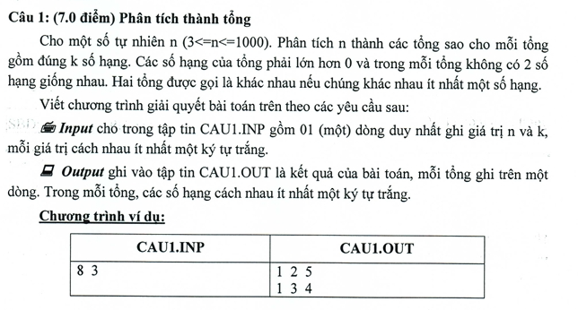

# Câu 1 Tin Học Trẻ 2018 AG

## Pascal
```pas
program Cau1;
type int = integer;
var n, k : int;
a : array[0..100] of int;
procedure print;
var i : int;
begin
  for i := 1 to k do
    write(a[i],' ');
  writeln;
end;
procedure try(i : int);
var j : int;
begin
  for j := a[i - 1] + 1 to n - k + i do
  begin
    a[i] := j;
    n := n - j;
    if (i < k) then
      try(i + 1)
    else if n = 0 then print;
    n := n + j;
  end;
end;
begin
  assign(input, 'Cau1.inp'); reset(input);
  assign(output, 'Cau1.out'); rewrite(output);
  readln(n, k);
  a[0] := 0;
  try(1);
end.
```
## C++
```cpp
#include<bits/stdc++.h>

using namespace std;

int n, k;
int a[101];

void print() {
    for (int i = 1; i <= k; i++)
        cout << a[i] << ' ';
    cout << '\n';
}

void tryFunc(int i) {
    for (int j = a[i - 1] + 1; j <= n - k + i; j++) {
        a[i] = j;
        n -= j;
        if (i < k)
            tryFunc(i + 1);
        else if (n == 0)
            print();
        n += j;
    }
}

int main() {
    freopen("Cau1.inp", "r", stdin);
    freopen("Cau1.out", "w", stdout);
    cin >> n >> k;
    a[0] = 0;
    tryFunc(1);
    return 0;
}
```
