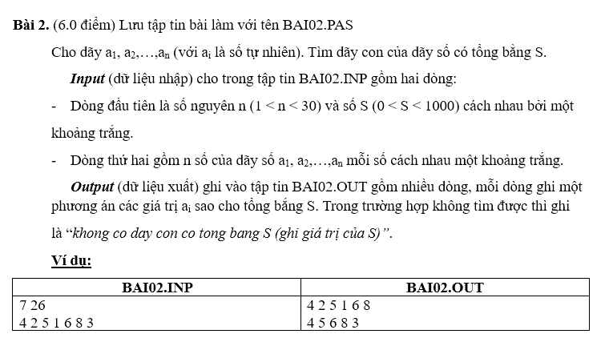

# Câu 1 Tin Học Trẻ 2018 AG

## Pascal
```pas
program Cau1;
type int = integer;
var n, k : int;
a : array[0..100] of int;
procedure print;
var i : int;
begin
  for i := 1 to k do
    write(a[i],' ');
  writeln;
end;
procedure try(i : int);
var j : int;
begin
  for j := a[i - 1] + 1 to n - k + i do
  begin
    a[i] := j;
    n := n - j;
    if (i < k) then
      try(i + 1)
    else if n = 0 then print;
    n := n + j;
  end;
end;
begin
  assign(input, 'Cau1.inp'); reset(input);
  assign(output, 'Cau1.out'); rewrite(output);
  readln(n, k);
  a[0] := 0;
  try(1);
end.
```
## C++
```cpp
#include <bits/stdc++.h>
using namespace std;

int n, k;
int a[101];

void print() {
    for (int i = 1; i <= k; i++)
        cout << a[i] << ' ';
    cout << '\n';
}

void tryFunc(int i) {
    for (int j = a[i - 1] + 1; j <= n - k + i; j++) {
        a[i] = j;
        n -= j;
        if (i < k)
            tryFunc(i + 1);
        else if (n == 0)
            print();
        n += j;
    }
}

int main() {
    ios_base::sync_with_stdio(0);
    cin.tie(0);  cout.tie(0);
    freopen("Cau1.inp", "r", stdin);
    freopen("Cau1.out", "w", stdout);
    cin >> n >> k;
    a[0] = 0;
    tryFunc(1);
    return 0;
}
```
# Câu 2 Tin Học Trẻ 2018 AG

## Pascal
```pas
program Cau2;
type int = integer;
var m, n : int;
a : array[0..100] of int;
procedure print;
var i : int;
begin
  for i := 1 to n do
    write(a[i],' ');
  writeln;
end;
procedure try(i : int);
var j : int;
begin
  for j := a[i - 1] downto 0 do
  begin
    a[i] := j;
    m := m - j;
    if (i < n) then
      try(i + 1)
    else if m = 0 then print;
    m := m + j;
  end;
end;
begin
  assign(input, 'Cau2.inp'); reset(input);
  assign(output, 'Cau2.out'); rewrite(output);
  readln(m, n);
  a[0] := m;
  try(1);
end.
```
## C++
```cpp
#include <bits/stdc++.h>
using namespace std;

int m, n;
int a[101];

void print() {
    for (int i = 1; i <= n; i++)
        cout << a[i] << ' ';
    cout << '\n';
}

void tryFunc(int i) {
    for (int j = a[i - 1]; j >= 0; j--) {
        a[i] = j;
        m -= j;
        if (i < n)
            tryFunc(i + 1);
        else if (m == 0)
            print();
        m += j;
    }
}

int main() {
    ios_base::sync_with_stdio(0);
    cin.tie(0);  cout.tie(0);
    freopen("Cau2.inp", "r", stdin);
    freopen("Cau2.out", "w", stdout);
    cin >> m >> n;
    a[0] = m;
    tryFunc(1);
    return 0;
}
```
# Câu 3 Tin Học Trẻ 2018 AG

## Pascal
```pas
program Cau3;
uses crt;
const maxn = 10000000;
var i, m, n : longint;
p : array[0..maxn] of boolean;
procedure sang;
var i, j : longint;
begin
  fillchar(p, sizeof(p), true);
  p[0] := false; p[1] := false;
  for i := 2 to trunc(sqrt(maxn)) do
    if p[i] then
    begin
      j := i * i;
      while j <= maxn do
      begin
        p[j] := false;
        j := j + i;
      end;
    end;
end;
begin
  sang;
  assign(input, 'Cau3.inp'); reset(input);
  assign(output, 'Cau3.out'); rewrite(output);
  readln(m, n);
  for i := m to n - 2 do
    if p[i] and p[i + 2] then
      writeln(i,' ',i + 2);
end.
```
## C++
```cpp
#include <bits/stdc++.h>
using namespace std;

const int maxn = 1e7 + 1;
int p[maxn];
int m, n;

void sang() {
    fill_n(p, size(p), 1);
    p[0] = p[1] = 0;
    for (int i = 2; i * i <= maxn; i++) 
        if (p[i])
            for (int j = i * i; j <= maxn; j += i)
                p[j] = 0;
}

int main() {
    ios_base::sync_with_stdio(0);
    cin.tie(0);  cout.tie(0);
    sang();
    freopen("Cau3.inp", "r", stdin);
    freopen("Cau3.out", "w", stdout);
    cin >> m >> n;
    for (int i = m; i <= n - 2; i++)
        if (p[i] && p[i + 2])
            cout << i << ' ' << i + 2 << '\n';
    return 0;
}
```
# Bài 1 Tin Học Trẻ 2021 AG

## Pascal
```pas
program Bai;
type
  int = longint;
  Arr2C = array[1..50, 1..50] of int;
  arr = array[1..50] of int;
var n, sum, max : int;
a : Arr2C;
b, luu : arr;
procedure readArr(var a : Arr2C; n : int);
var i, j : int;
begin
  for i := 1 to n do
    for j := 1 to i do
      read(a[i, j]);
  readln;
end;
procedure writeArr(a : arr; n : int);
var i : int;
begin
  for i := 1 to n do
    write(a[i],' ');
  writeln;
end;
procedure try(i, k : int);
var j : int;
begin
  for j := k to k + 1 do
  begin
    sum := sum + a[i, j];
    b[i] := a[i, j];
    if i < n then
      try(i + 1, j)
    else
      if max < sum then
      begin
        max := sum;
        luu := b;
      end;
    sum := sum - a[i, j];
  end;
end;
begin
  assign(input, 'Bai01.inp'); reset(input);
  assign(output, 'Bai01.out'); rewrite(output);
  readln(n);
  readArr(a, n);
  max := -maxlongint;
  sum := 0;
  try(1, 1);
  writeln(max);
  writeArr(luu, n);
end.
```
## C++
```cpp
#include <bits/stdc++.h>
using namespace std;

int n, m = INT_MIN, sum = 0;
int a[50][50], b[50], luu[50];

void readArr(int a[50][50], int n) {
    for (int i = 1; i <= n; i++)
        for (int j = 1; j <= i; j++)
            cin >> a[i][j];
}

void writeArr(int a[50], int n) {
    for (int i = 1; i <= n; i++)
        cout << a[i] << ' ';
    cout << '\n';
}

void copyArr(int a[], int b[], int s) {
    copy(b, b + s, a);
}

void tryFunc(int i, int k) {
    for (int j = k; j <= k + 1; j++) {
        sum += a[i][j];
        b[i] = a[i][j];
        if (i < n)
            tryFunc(i + 1, j);
        else
            if (m < sum) {
                m = sum;
                copyArr(luu, b, n + 1);
            }
        sum -= a[i][j];
    }
}

int main() {
    ios_base::sync_with_stdio(0);
    cin.tie(0);  cout.tie(0);
    freopen("Bai01.inp", "r", stdin);
    freopen("Bai01.out", "w", stdout);
    cin >> n;
    readArr(a, n);
    tryFunc(1, 1);
    cout << m << '\n';
    writeArr(luu, n);
}
```
# Bài 2 Tin Học Trẻ 2021 AG

## Pascal
```pas
program Bai02;
type int = longint;
arr = array[1..100] of longint;
var n, s, k, sum : int;
a, b : arr;
procedure readArr(var a : arr; n : int);
var i : int;
begin
  for i := 1 to n do
    read(a[i]);
  readln;
end;
procedure print;
var i : int;
begin
  for i := 1 to n do
    if b[i] = 1 then
      write(a[i],' ');
  writeln;
  k := 1;
end;
procedure try(i : int);
var j : int;
begin
  for j := 1 downto 0 do
  begin
    b[i] := j;
    s := s - a[i] * b[i];
    if s = 0 then
      print
    else if (i < n) and (s > 0) then
      try(i + 1);
    s := s + a[i] * b[i];
  end;
end;
begin
  assign(input, 'BAI02.INP'); reset(input);
  assign(output, 'BAI02.OUT'); rewrite(output);
  readln(n, s);
  k := 0;
  readArr(a, n);
  try(1);
  if k = 0 then
    write('khong co day con co tong bang ',s);
end.
```
## C++
```cpp
#include <bits/stdc++.h>
using namespace std;

int n, s, k = 0;
int a[101], b[101];

void print() {
    for (int i = 1; i <= n; i++)
        if (b[i])
            cout << a[i] << ' ';
    cout << '\n';
    k = 1;
}

void tryFunc(int i) {
    for (int j = 1; j >= 0; j--) {
        b[i] = j;
        s -= (a[i] * b[i]);
        if (s == 0)
            print();
        else if (i < n && s > 0)
            tryFunc(i + 1);
        s += (a[i] * b[i]);
    }
}

int main() {
    ios_base::sync_with_stdio(0);
    cin.tie(0);  cout.tie(0);
    freopen("Bai02.inp", "r", stdin);
    freopen("Bai02.out", "w", stdout);
    cin >> n >> s;
    for (int i = 1; i <= n; i++)
        cin >> a[i];
    tryFunc(1);
    if (k == 0)
        cout << "khong co day con co tong bang " << s;
    return 0;
}
```
# Bài 2 Tin Học Trẻ 2023 AG

## Pascal
```pascal
  program Bai02;
uses crt;
type int = longint;
arr = array[0..9] of int;
var i, n : int;
ch : char;
st, s : string;
a : arr;
function hv(st : string; a : arr; n : int):string;
var i : int;
begin
  hv := '';
  for i := 1 to n do
    hv := hv + st[a[i]];
end;
function mahoa(st : string; a : arr; n : int):string;
var i : int;
begin
  mahoa := '';
  for i := 1 to (n - (length(st) mod n)) mod n do
    st := st + ' ';
  for i := 1 to length(st) div n do
    mahoa := mahoa + hv(copy(st, (i - 1) * n + 1, n), a, n);
end;
function xauchung(a, b : string):string;
var i, j, m, n, len, r, c : int;
dp : array[1..255, 1..255] of int;
begin
  m := length(a);
  n := length(b);
  for i := 1 to m do
    dp[i][1] := 0;
  for j := 1 to n do
    dp[1][j] := 0;
  len := 0;
  for i := 2 to m do
    for j := 2 to n do
      if a[i - 1] = b[j - 1] then
      begin
        dp[i][j] := dp[i - 1][j - 1] + 1;
        if dp[i][j] > len then
        begin
          len := dp[i][j];
          r := i;
          c := j;
        end;
      end
      else dp[i][j] := 0;
  xauchung := '';
  while dp[r][c] <> 0 do
  begin
    xauchung := a[r - 1] + xauchung;
    dec(r);
    dec(c);
  end;
end;
begin
  clrscr;
  read(n);
  for i := 0 to n do
  begin
    read(ch);
    a[i] := ord(ch) - 48;
  end;
  readln;
  readln(st);
  s := mahoa(st, a, n);
  writeln(s);
  write(length(xauchung(st, s)));
  readln;
end.
```
## C++
```cpp
#include <bits/stdc++.h>
using namespace std;
typedef string str;
int n;
char ch;
str st, s;

str hv(str st, vector<int> a, int n) {
    str res;
    for (int i = 0; i < n; i++)
        res += st[a[i] - 1];
    return res;
}

str mahoa(str st, vector<int> a, int n) {
    while (st.size() % n != 0)
        st += ' ';
    str res;
    for (int i = 0; i < st.size() / n; i++) {
        int x = i * n, y = x + n;
        res += hv(st.substr(x, y), a, n);
    }
    return res;
}

string lcs(string a, string b) {
    int m = a.size(), n = b.size(), len = 0, r, c;
    vector<vector<int>> dp(m+1, vector<int>(n+1, 0));
    for(int i = 1; i <= m; i++)
        for(int j = 1; j <= n; j++)
            if(a[i - 1] == b[j - 1]) {
                dp[i][j] = dp[i - 1][j - 1] + 1;
                if(dp[i][j] > len) {
                    len = dp[i][j];
                    r = i;
                    c = j;
                }
            }
            else dp[i][j] = 0;

    string result;
    while(dp[r][c] != 0) {
        result = a[r - 1] + result;
        r--;
        c--;
    }
    return result;
}

int main() {
    ios_base::sync_with_stdio(false);
    cin.tie(NULL); cout.tie(NULL);
    freopen("Bai02.inp", "r", stdin);
    freopen("Bai02.out", "w", stdout);
    cin >> n;
    vector<int> a(n);
    for (int i = 0; i < n; i++) {
        cin >> ch;
        a[i] = (int(ch) - 48);
    }
    cin.ignore();
    getline(cin, st);
    s = mahoa(st, a, n);
    cout << s << '\n';
    cout << lcs(st, s).size();
    return 0;
}
```
